# Software & Tool Workflow Map

## Visual Overview of Development Environment

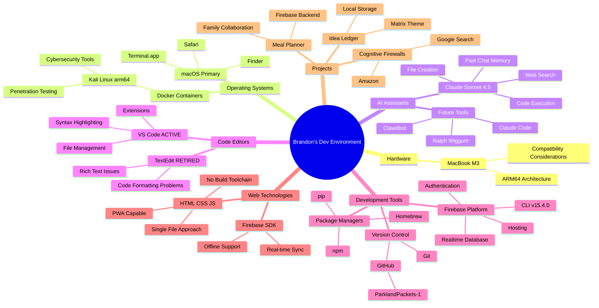

## Detailed Workflow Diagrams

### Project Development Flow

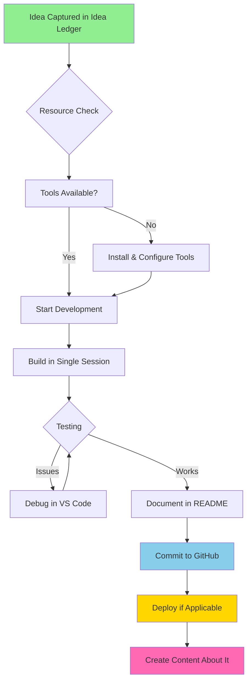

### Cognitive Firewall Development Stack

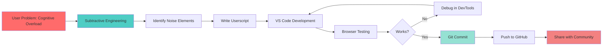

### Firebase Project Workflow

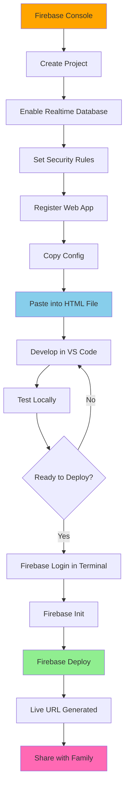

### Learning Progression Path

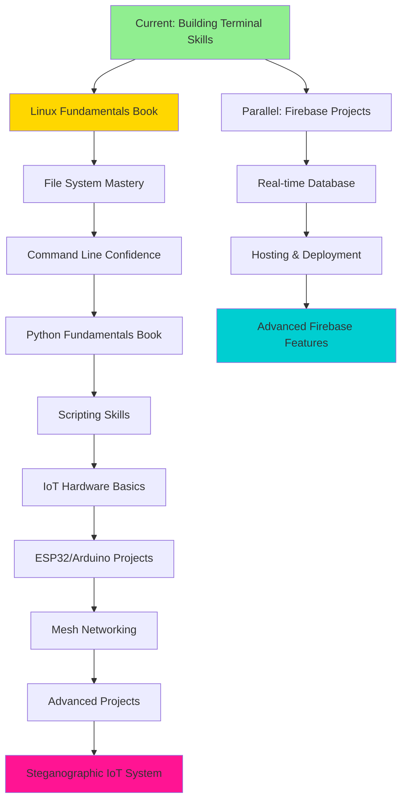

### Tool Installation Decision Tree

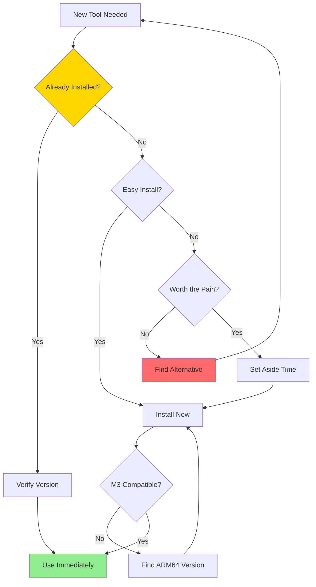

### Content Creation Pipeline

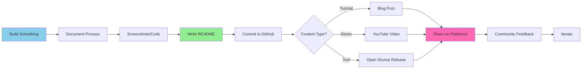

### Hacking the Homestead Ecosystem

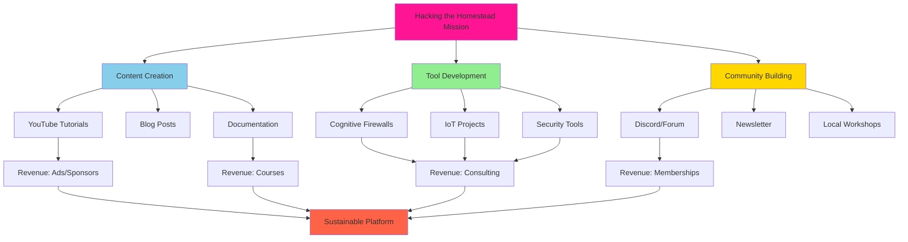

## Technology Stack Layers

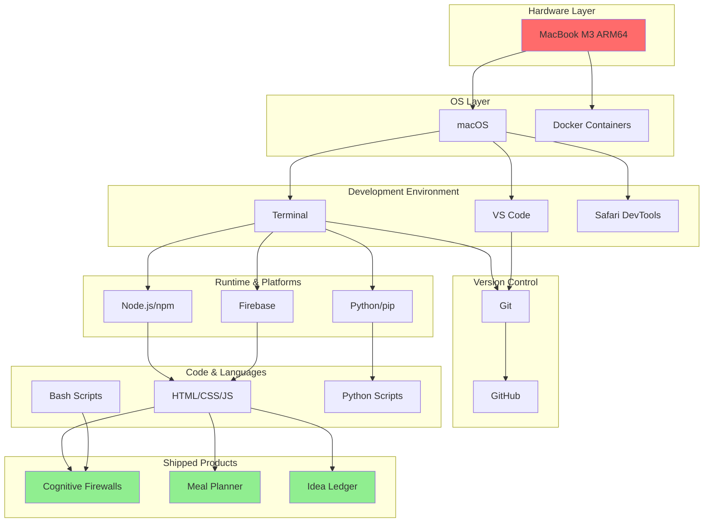

## Project Dependencies Map

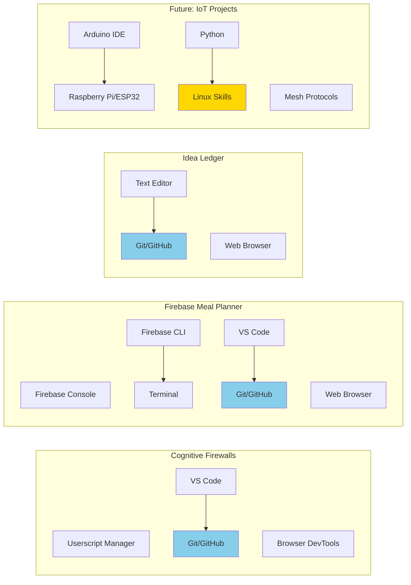

## AI Assistant Integration Flow

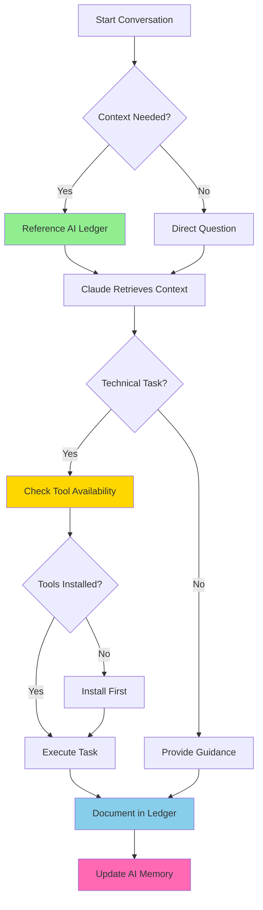

---

## How to Use These Maps

### For Development Planning
1. Start with the **Project Development Flow** to understand the complete cycle
2. Reference the **Tool Installation Decision Tree** before adding new tech
3. Use the **Technology Stack Layers** to understand dependencies

### For Learning Path
1. Follow the **Learning Progression Path** to see what's next
2. Identify gaps between current skills and project requirements
3. Use Firebase or Cognitive Firewall workflows as templates

### For Platform Building
1. **Hacking the Homestead Ecosystem** shows the big picture
2. **Content Creation Pipeline** connects building to teaching
3. Track progress through GitHub and content metrics

### For AI Conversations
1. **AI Assistant Integration Flow** shows how context works
2. Reference specific workflows when starting new projects
3. Update this map as new tools and patterns emerge

---

## Legend

- 🟢 Green: Completed/Active tools
- 🔵 Blue: In progress/Learning
- 🟡 Yellow: Planned/Queued
- 🔴 Red: Blockers/Pain points
- 💗 Pink: Content/Community

---

*Last Updated: January 26, 2026*
